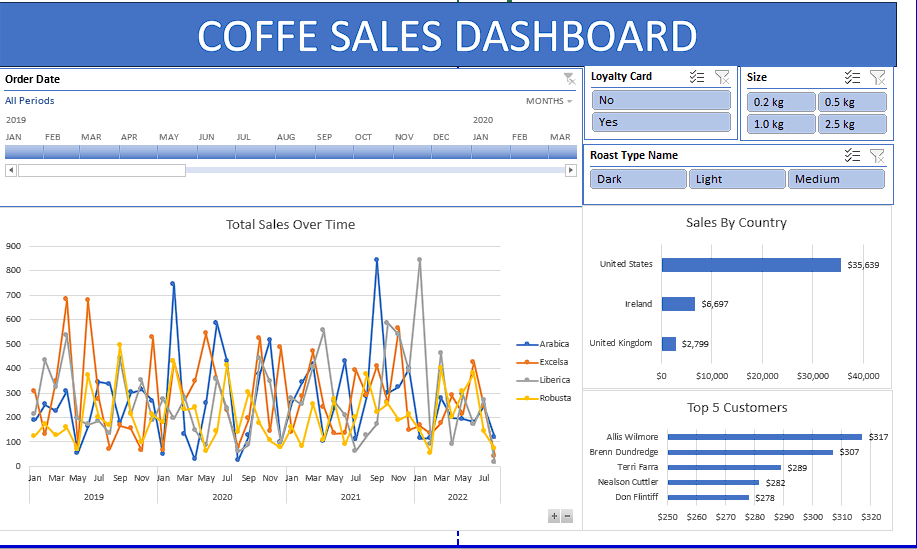

# coffee_orders

In this project data was cleaned, transformed and visualized in order to summarize it and exctract insights. Functions like xlookup, index-match, nested IF functions and formatting tools were used to clean and transform data. Pivot tables extracted useful information that later on was summarized on a dynamic dashboard with the help of slicers and a timeline. Sheets 'orders', 'customers' and 'products' contain the raw data.

